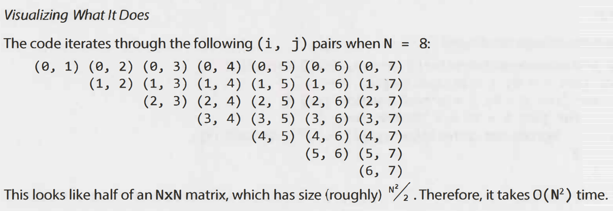

# Big O

- Big O : Upper bound
- Big omega : Lower bound
- Big theta : Tight bound

```java

    //Each of the sum calls would be added to call stack and will take actual memory
    // O(N) space
    int sum(int n){
        if(n <= 0)
            return 0;
        return n+sum(n-1);
        
    }
    
    // There will be O(n) calls to pairSum. However, those calls dont exist simultaneously on the call stack,so you need
    // O(1) space
    int pairSumSequence(int n){
        int sum = 0;
        for(int i = 0; i < n; i++)
            sum += pairSum(i,i+1);
        return sum;
    }
    
    int pairSum(int a, int b){
        return a+b;
    }
```
## Drop the constants

It is possible for O(N) code to run faster than O(1) code for specific inputs.Big O just describes the rate of increase.
For this reason, we drop the constants in runtime. An algorithm that one might have described as 0(2N) is actually O(N).

## Drop the Non-Dominant terms

You should drop the non-dominant terms

- O(N + log N) becomesO(N).

## Amortized Analysis

Sometimes, an algorithm performs well most of the time but has occasional slow operations. Instead of analyzing the 
worst case for each operation, amortized analysis spreads out the cost over multiple operations to get a more accurate 
performance estimate.

X insertions take 0(2X) time. The amortized time for each insertion is 0(1). 

## Recursive runtimes

```java
    int f(int n){
        if(n <= 1)
            return 1;
        return f(n-1) + f(n-1);
}
```
Using master method, when we draw the recursion tree, O(branches^depth), here its 2^N

## Exercise1

```java
//visualizing loops

void printUnorderedPairs(int[] array){
    for(int i = 0;i < array.length; i++){
        for(int j = 0; j < array.length; j++){
            System.out.println(array[i]+","+array[j]);
        }
    }
}
```


## Exercise 2

```java
//common mistake

void printUnorderedPairs(int[] arrayA, int arrayB){
    for(int i = 0;i < arrayA.length; i++){
        for(int j = 0; j < arrayB.length; j++){
            if(arrayA[i] < arrayB)
                System.out.println(arrayA[i]+","+arrayB[j]);
        }
    }
}
```
Common mistake is to keep time complexity as O(N^2), but actually its O(ab)

## Exercise3
```java
    int sum(Node node){
        if(node == null)
            return 0;
        return sum(node.left) + node.value + sum(node.left);
}
```
Running Time : 2^lg(N) = N

