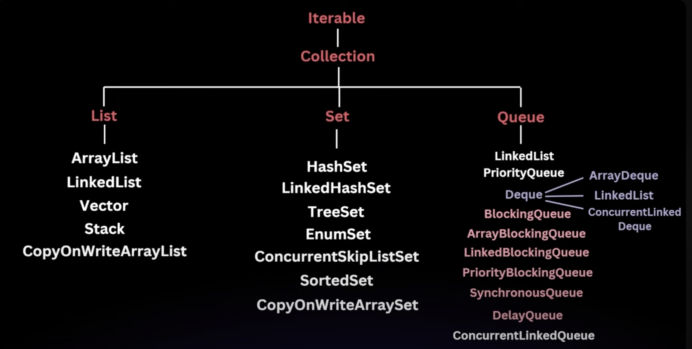
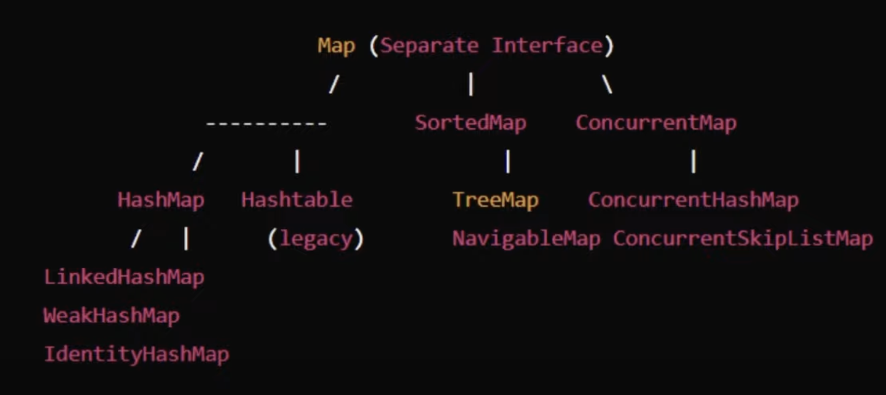

# Java Collections

The collection framework is organized into a hierarchy where the core interfaces are at the top, and the specific 
implementations extend these interfaces.

- Collection : The root interface for all the other collection types.
- List : An ordered collection that can contain duplicate elements(e.g., ArrayList, LinkedList)
- Set : A collection that cannot contain duplicate elements (e.g., HashSet, TreeSet)
- Queue : A collection designed for holding elements prior to processing(e.g., PriorityQueue, LinkedList)
- Deque : A double ended queue that allows insertion and removal from both ends(e.g., ArrayDeque) //pronounced dek
- Map : An interface that represents a collection of key-value pairs (e.g., HashMap, TreeMap)

## Vector

A vector is a part of java.util package and is one of the legacy classes in JAVA that implements the List interface.
A vector is thread safe, but due to synchronisation overhead, ArrayList is generally preferred in single threaded 
environment.

Key features:
- Dynamic Array : Like ArrayList, Vector is a dynamic array that grows automatically when more elements are added than
    its current capacity.
- Synchronized : All methods in Vector are thead safe, however this introduces overhead in single threaded environments.
- Legacy Class
- Resizing Mechanism : Like ArrayList
- Random Access : Like ArrayList

## Sorted Map

Sorted map is an interface that extends Map and guarantees that the entries are sorted based on the keys, either in 
their natural ordering or by a specified Comparator.
