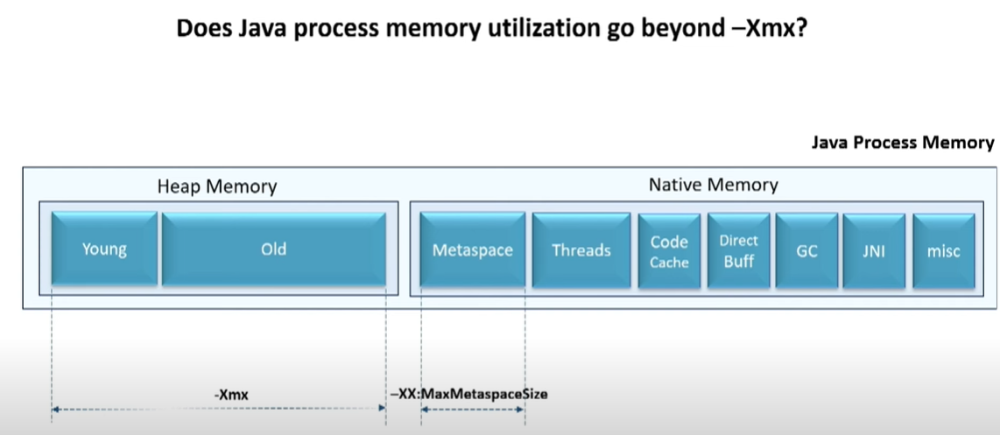
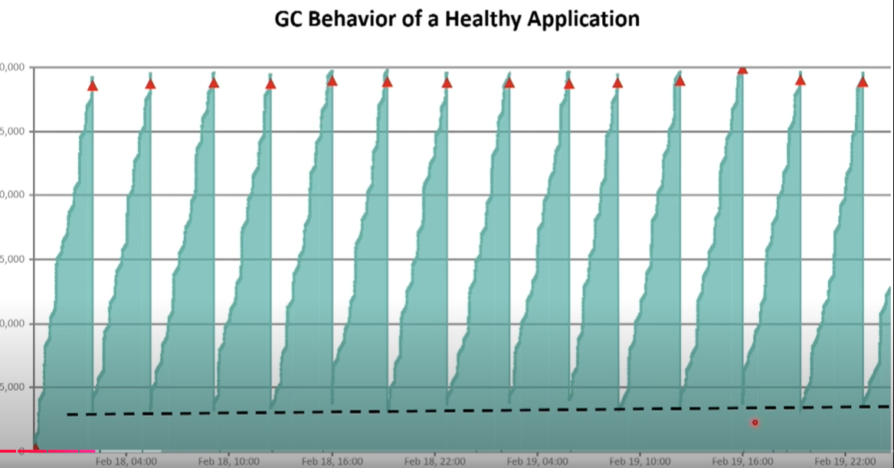
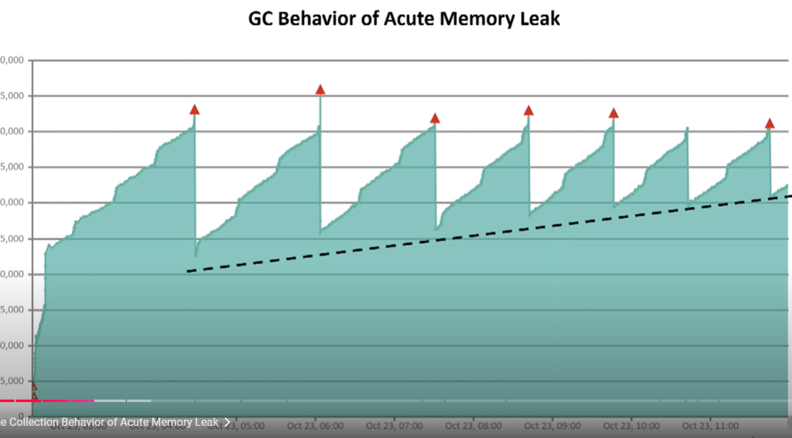
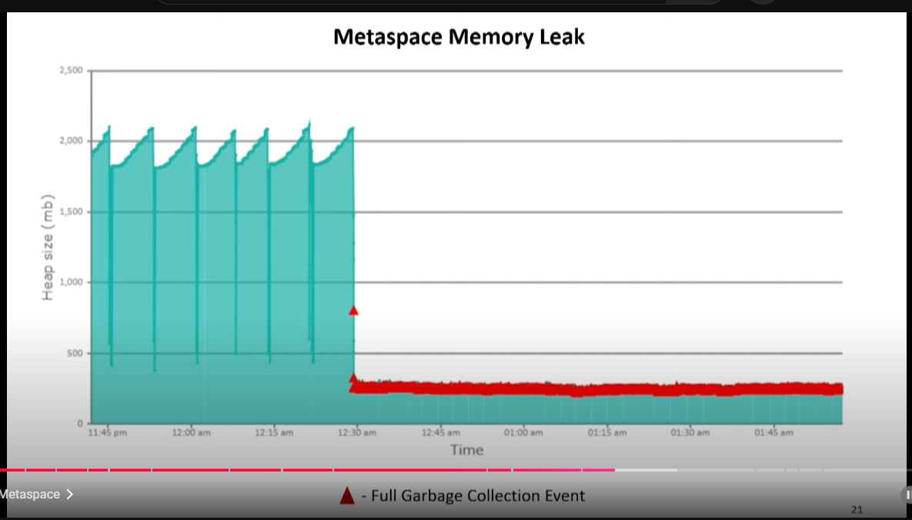

# Memory Leaks in JAVA

## Causes of memory leaks in JAVA

- Excessive use of static members
	- Static members tend to exist throughout the lifetime of application and tend 	not to be garbage collected.
- Unclosed resources
- Improper equals() and hashCode() implementations
- Excessive session objects
- Poorly written custom data structure

## Memory leaks in JAVA

- Do not create unnecessary objects
- Avoid string concatenation and use String Builder
- Do not store a massive amount of data in the session
- Time out the session when no longer used
- Avoid the use of static objects, as they live for full application life. So better set the reference to null explicitly.
- Always close the Result Set, statements and connection objects in finally block.

## Java Memory Management

### Does JAVA process memory utilization go beyond -Xmx?

Suppose we set our Java process heap size as 6 GB, will it go beyong 6 GB?

### Memory Regions

- Heap Memory - It is the primary memory and its divided into 2 regions.
    - Young generation heap memory : New objects
    - Old generation heap memory : If objects have lived long enough they go to old generation heap

- Native Memory
    - MetaSpace : For ex : class defintions
    - Threads : (stack resides in the native memory allocated for the thread)
    - Code cache : Optimisation of source code
    - Direct Buffer : IO Operations
    - GC : Garbage collector
    - JNI : For connecting C/C++ code to Java
    - Miscellaneous : Depends on JVM vendor, for optimisation.

  
    
## How to know the type of OutOfMemoryError?

java.lang.OutOfMemoryError: <type>

### Java Heap Space

Most common memory error. It is mostly caused by:
- Increase in traffic volume : For this increase the heap size(-XmX)
- Memory leak due to buggy code : For this fix the memory leak in the code

A healthy app will mostly have a 0 slope for dotted line. While a memory leak app will have a psoitive slope.

 

 

 ### References

 Outgoing references : Objects referenced by current objects
 Incoming references : Objects referencing the current object
 
 ## How to study GC behavior?

Enable GC logs(always). Almost zero overhead.

-Xlog:gc*:file=<file-path> //from java 9

GC Log Analysis tool : GCEasy, as GC log is a quite cryptic file

### Capturing Heap dump - When we know there is a memory leak

yc-data-script : 360 degree troubleshooting artifacts

HeapHero tool for analysing heap dump.
Look for the largest object. And check its outgoing references. Here check which data structure is causing issue

Incoming reference - Who is keeping this object alive

### Artifacts

- Garbage collection log
- Heap dump

### Tools

- GCEasy (GC log analysis)
- HeapHero
- Eclipse MAT
- JVisualVm

# OutOfMemoryError 

## Java Heap space error

Discussed in above block.

## GC overhead limit exceeded

Diagnosis same as Java Heap Space. As sometimes, we get this error with Heap space error.

## Requested array size exceeds VM limit

Happens when we try to allocate an array bigger than the heap size.
We can see stacktrace and check this error.

## Metaspace error

Happens when we use too many 3rd party frameworks or load too many classes.

 Artifacts : java {app_name} -Xlog:class+lod=info:<filename>

 To fix we can increase the metaspace, or fix code to load less number of classes.

 ## Permgen space

 Happens in Java 7 and below

 Now this Permgen space has been replaced by Metaspace.
 Analysis is same as Metaspace.

 ### Unable to create new native threads

Artificats

- Thread dump

Tools to analyse like FastThread, Text Editor

 Happens when threads are leaking. It can fixed by,

- fixing thread leak in code
- increase the thread limits set at OS (ulimit -u)
- kill other process
- increase ram capacity
- reduce java heap size

### Direct buffer memory

Caused by increase or leak in direct buffers usage.
- java.nio package
- moving from Spring RestTemplate to WebClient
- image processing libraries
- networking libraries
- some JDBC libraries

Artifacts:
- stacktrace

Solutions:
- Fix memory leak code
- Increase -XX:MaxDirectMemorySize
- Upgrade to Java 17 (There are some issues in Java 11)

## Kill process or sacrifice child

Kernel can terminate JVM process if JVM is requiring too much memory.

Artifacts:
- dmesg - Prints kernel logs

### Reason stack_trace_with_native_method

Happens when Java connects with C/C++ process, but mostly people don't use JNI.