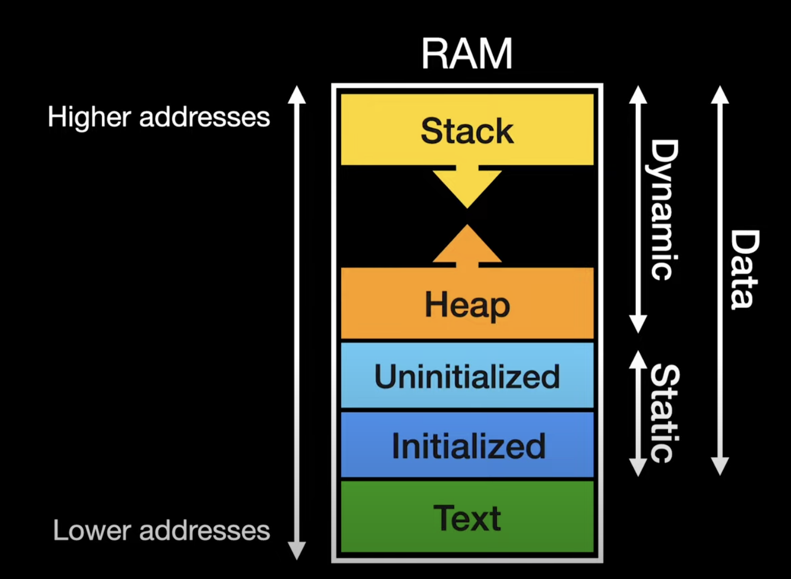

# C memory layout

## Text
    
Contains machine code of the program. Its read only and fixed size, so nothing can change instructions of a program 
while its running.

## Data

### Static

Used for compile time memory allocation. For ex: array size. Once a program is compiled you can't change it during runtime.

```c
// stored in static part of data
// once created we cant change this
char *str = "hello";
```

#### Initialized data segment

Initialized statics and globals. Its R/W and fixed size

#### Unintialized data segment 

Also called, BSS(Block started by symbol) section. Contains uninitialized statics and globals. Its R/W and fixed size.

### Dynamic

Dynamic memory is memory that is allocated after the program starts running.
Dynamic memory stays reserved until it is deallocated or until the program ends.

```c
// stored in dynamic part of data, viz stack
char str[] = "hello";
```

#### Heap

Variable in size. Can cause memory leaks if not handled properly.

#### Stack

Contains local variables, function calls and input arguments

