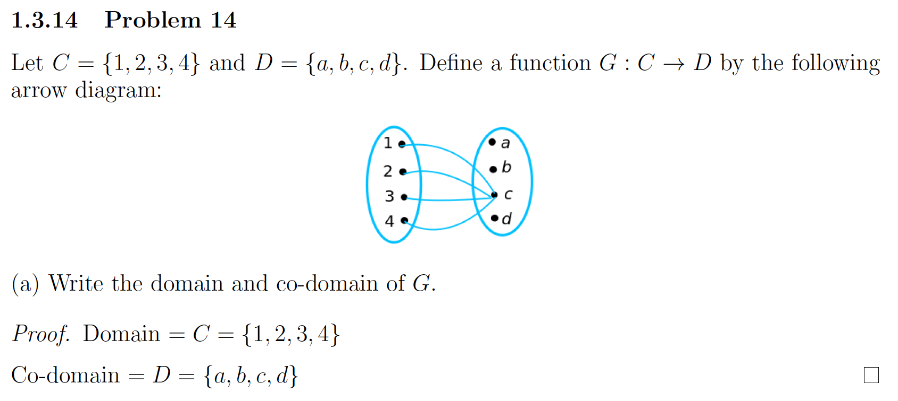

# Speaking Mathematically

## Variables

A variable is sometimes thought of as a mathematical “John Doe” because you can use it as a placeholder when you want to
talk about something but either 
1.  you imagine that it has one or more values but you don’t know what they are, or 
2. you want whatever you say about it to be equally true for all elements in a given set, and so you don’t want to be
restricted to considering only a particular, concrete value for it.

Exercise 1.1 consisted rewriting statements to other forms. This exercise was more like active and passive voice.

Active : I want an ice-cream.
Passive : An ice-cream is wanted by me.

1. Is there a real number whose square is -1?
a. Is there a real number x such that ___ ?
b. Does there exist ___  such that x^2 = -1?

## The Language of Sets

A set is just a collection of elements with no duplicates and no order. Like a box
For ex:
    4 : A plain number not a set.
    {4} : A set with one element, number 4
    {{4}} : A set with one element, the set {4}

4 ∈ {4}
{4} ∈ {{4}}
4 ∈ {{4}} wrong, 4 is not directly inside, only {4} is

### Notation of Sets

- Set Roster notation : {1,2,3,4} or {1,2,3,4...}
- Set Builder notation : {x ∈ S | P(x)}
    Here S is the set where, of all elements x in S such that P(x) is true

### Frequent Sets

- R : set of all real number
- Z : set of all integers
- Q : set of all rational numbers, or quotient of integers

### Proper Subsets

If A and B are sets, then A is called a subset of B, written as A ⊆ B iff every element of A is also an element of B.
(includes a proposition that A=B).

A is a proper subset of B, iff every element of A is in B but there is atleast one element of B that is not in A
(does not include a proposition that A=B).

### Ordered n-tuple

The ordered n-tuple (x1, x2, ... , xn). Ordered pair is an ordered 2-tuple.
(x1, x2,.., xn) = (y1, y2,..., yn) <=> x1 = y1, x2 = y2, ... , xn = yn

### Set vs Tuple

- Order : For set its not important, for tuple its important
- Duplicates : In set duplicates not allowed, while in tuples its allowed
- Notation : Set {1,2,3} = {3,2,1}
             Tuple : (1,2,3) ≠ (3,2,1)
In set membership matters.
In tuples position/order matters

### Cartesian product
A1 x A2 = {(a1, a2) | a1 ∈ A1 and a2 ∈ A2}
is the Cartesian product of A1 and A2

R x R is the Cartesian plane

### String

Let n be a positive integer. Given a finite set A, a string of length n over A is an ordered n-tuple of elements of A 
written without parentheses or commas. The elements of A are called the characters of the string. 
    The null string over A is defined to be the “string” with no characters. It is denoted by ƛ and has length 0. 
    If A = {0, 1}, then a string over A is called a bit string.

## The Language of relations and functions

### Relations

Let A and B be sets. A relation R from A to B is a subset of A x B. Given an ordered pair (x,y) in A x B, x is related
to y by R written as x R y, iff (x,y) is in R.The set A is called the domain of A and the set B is called its co-domain.
Symbolically,
x R y means that (x,y) ∈ R
x R̸ y means that (x,y) ∉ R

### Function

A function F from a set A to set B is a relation with domain A and co-domain B that satisfies the following properties:
a) For every element x in A, there is an element y in B such that (x,y) ∈ F.
b) For all elements x in A and y and z in B,
    if (x,y) ∈ F and (x,z) ∈ F, then y = z

f equals g, written f = g, iff, f(x) = g(x) for all x in A

## The Language of Graphs

dd