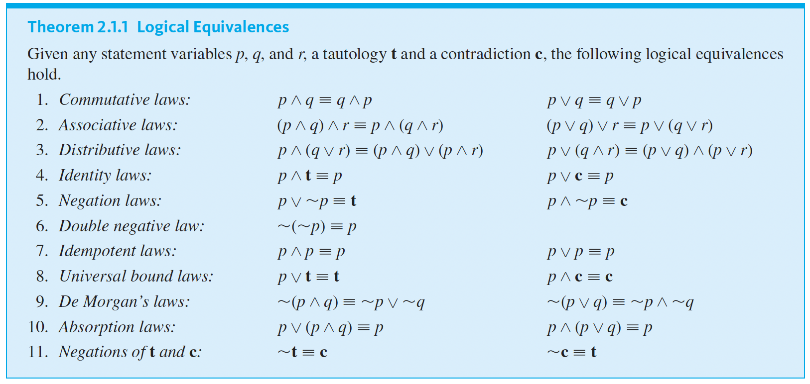

# The Logic of Compound statements

## Proposition

A statement or proposition is a sentence that is true or false but not both.

## Conditional statements (p -> q)

T T T
T F F
F T T
F F T

Consider conditional statements as a promise.
In logic, an implication p → q is considered false only when p is true and q is false. That’s the only scenario where a 
promise is broken.

Suppose, a statement “If I win the lottery, I’ll buy you a car.”
If I don’t win the lottery (p = F), then whether or not I buy you a car (q = T or F) doesn’t violate the statement. 
So, the implication still holds true.
It’s only a lie (false) if I win the lottery (p = T) but don’t buy you a car (q = F).

P -> Q ≣ ~P v Q 

## Normal language to Discrete Maths notation

- P but Q means p and q
    For ex, It is not hot and it is sunny : ~h ∧ s

- neither P nor Q means ~P and ~Q
    For ex, It is neither hot nor sunny : ~h ∧ ~s

## Logical Equivalences

Many times logical equivalences lead us nowhere and we should make truth table at that time.

## Logic in algebra

P : 0 < x
Q : x < 3
R : x = 3

- x <= 3 : Q ∨ R
- 0 < x < 3 : P ∧ Q
- 0 < x <= 3 : P ∧ (Q ∨ R) 

## Converse, Inverse, Contrapositive

- Contrapositive of p -> q = ~q -> ~p, which is equivalent
- Converse of p -> q = q->p
- Inverse of p -> q = ~p -> ~q

The converse and inverse of a conditional statement are logically equivalent to each other.

## Tautology and Contradiction

Tautology -> All true
Contradiction -> All false

## Caution

If we mechanically accept logical truth without context or understanding, we risk making conclusions that are 
technically valid but meaningless or even misleading.   
    For ex : If the moon is made of green cheese, then 2 + 2 = 4.

This is an F->T ≣ T statement, But the conclusion has nothing to do with the premise. Yet, logic says the implication 
is true, just because the premise is false. This is logically correct, but completely useless in real-world reasoning.