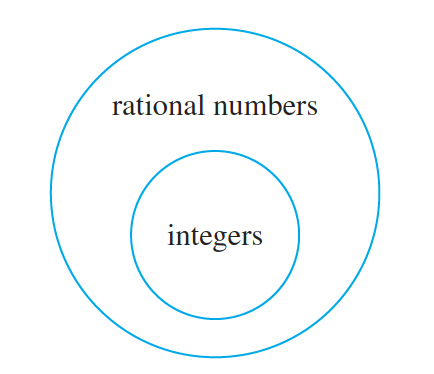
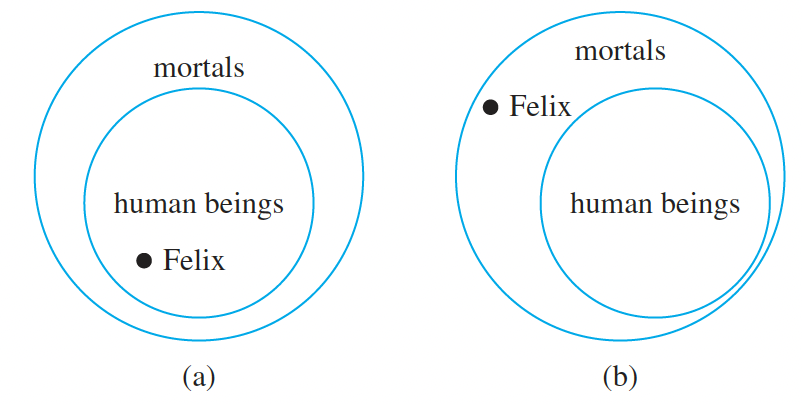

# Arguments with Quantified Statements

To say that an argument form is valid means, no matter what particular predicates are substituted for the predicate
symbols in its premises, if the resulting premise statements are all true, then the conclusion is also true.
    An argument is called valid iff its form is valid. It is called sound iff its form and its premise are
    true.

## Universal Instantiation

If a property is true of everything in a set, then it is true of any particular thing in the set.

All men are mortal.
Socrates is a man.
Therefore, Socrates is mortal 

## Universal Modus Ponens

∀x, if P(x) then Q(x).
P(a), for particular a.
Therefore, Q(a)

## Universal Modus Tollens

∀x, if P(x) then Q(x).
~Q(a), for particular a.
Therefore, ~P(a)

## Universal Transitivity

∀x P(x) -> Q(x)
∀x Q(x) -> R(x)
Therefore, ∀x P(x) -> R(x)

## Diagram to test validity

All integers are rational numbers.
∀ integer n, n is a rational number.

## Diagram to show invalidity

All human beings are mortal.
Felix is mortal.
Therefore, Felix is a human being.

Below diagram shows that the logic is wrong.
Below example is also the form of converse error.

## Converse Error (Affirming the consequent)

∀x, if P(x) then Q(x).
Q(a), for particular a.
Therefore, P(a) (Invalid)

## Inverse Error (Denying the antecedent)

∀x, if P(x) then Q(x).
~P(a), for particular a.
Therefore, ~Q(a) (Invalid)

## An implication is equivalent to its contrapositive

p -> q ≣ ~q -> ~p