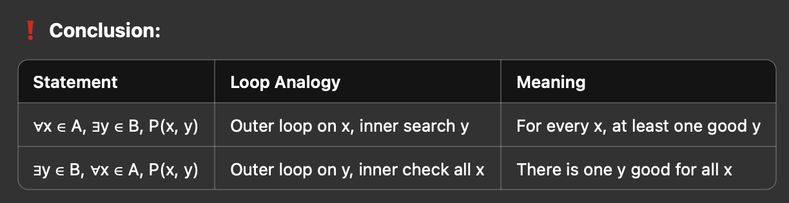
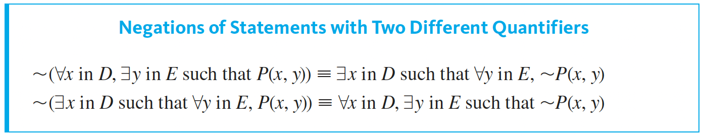
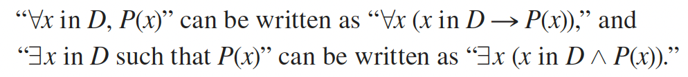

# Statements with Multiple quantifiers

∀ -> for all
∃ -> for some

When a statement contains more than one kind of quantifier, we imagine the actions suggested by the
quantifiers as being performed in the order in which the quantifiers occur.

Also, for P(x,y) you are not allowed to change your x once you have specified it initially.

## Negations of statements with two different quantifiers

In a statement containing both ∀ and ∃, changing the order of the quantifiers can
significantly change the meaning of the statement.

## Logical Notation

We wish to say: "Everyone takes the course if they are a student-in-the-class". 
That is the implication ∀𝑥 (𝑆(𝑥)→𝑅(𝑥))
We do not wish to claim: "Everyone is a student-in-the-class and they take the course". 
That is the conjunction ∀𝑥 (𝑆(𝑥)∧𝑅(𝑥))

For the existential, the claim is "there is a student-in-the-class and they take this course." 
Thus it uses the conjunction: ∃𝑥 (𝑆(𝑥)∧𝑅(𝑥))
If x is not a student in the class, then 𝑆(𝑥) → 𝑅(𝑥) is still considered true, no matter 
whether 𝑅(𝑥) is true or false.

## Unique Quantifier (∃!)
∃!xP(x) ≣ ∃x ⟃ D [P(x) ∧ ∀y ⟃ D(P(y) -> x=y)]

## Prolog

Installed SWI prolog, see prolog folder for more examples