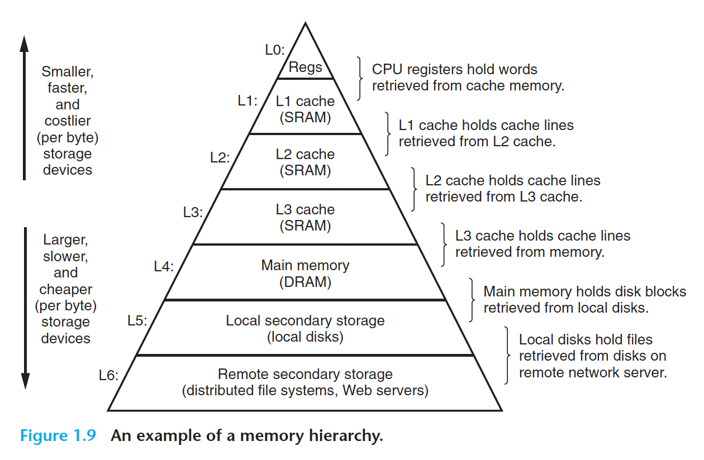

# Tour of Computer Systems

Files that exclusively consist of ASCII characters are known as text files.
    All other files are known as binary files.

All attempts by an application program to manipulate the hardware must go through the operating system.

## OS manages hardware

- processes : Abstraction for processor, main memory and I/O devices
- virtual memory : Abstraction for main memory and disk I/O devices
- files : files are an abstraction for I/O devices

## Processes

A process is the operating system’s abstraction for a running program.
In modern systems a process can actually consist of multiple execution units, called threads, each running in the 
context of the process and sharing the same code and global data.

## Virtual Memory

Virtual memory is an abstraction that provides each process with the illusion that it has exclusive use of the main 
memory. Each process has the same uniform view of memory, which is known as its virtual address space.
The virtual address space consists of areas like : 

- Program code and data
- Heap
- Shared libraries : Near the middle of the address space is an area that holds the code and data for shared libraries 
                    such as the C standard library and the math library.
- Stack : Compiler uses to implement function calls.
- Kernel virtual memory : Address space is reserved for the kernel.

## Files

A file is a sequence of bytes, nothing more and nothing less.
All input and output in the system is performed by reading and writing files, using a small set of system calls known 
as Unix I/O.

## Amdahl's law

The main
idea is that when we speed up one part of a system, the effect on the overall system performance depends on both how 
significant this part was and how much it sped up.

