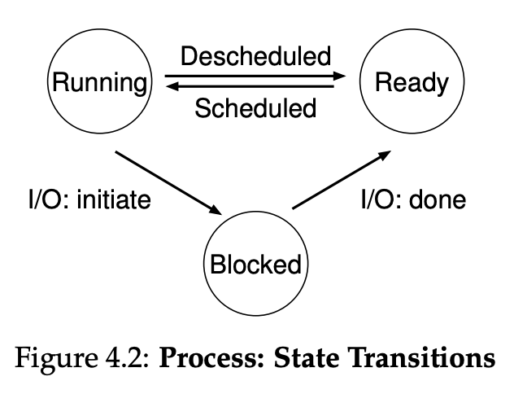

# Process

Process is a running program.

In UNIX systems, each process by default has three open file descriptors, for standard input, output, and
error; these descriptors let programs easily read input from the terminal
and print output to the screen.

CPU only waits for blocked state, once process is queued in ready, it doesent wait to put it into running



Process A
├── Memory
├── Files
└── Thread

Process B
├── Separate Memory
├── Separate Files
└── Thread

Process are isolated from each other

One Process
├── Shared Memory
├── Shared Heap
├── Shared Files
│
├── Thread 1
├── Thread 2
└── Thread 3

Thread share resources.

## Process ownership

The company is the process.
The employees are the threads.
Employees do the actual work.
But the company owns the building and equipment.

Process
├── Virtual Address Space
├── Heap
├── Loaded Libraries
├── Open Files
├── Sockets
├── Environment Variables
├── Current Working Directory
└── Threads

## File Descriptor

File descriptor is a small integer that represents an open resource.

- Input : 0
- Output : 1
- Errors : 2

## Bash

When you type, "ls -l"
    Bash roughly does,

```C
fork();
execvp("ls", args);
wait();
```

## xv6

xv6 for x86 not working on Mac M1, risc-v version is working

