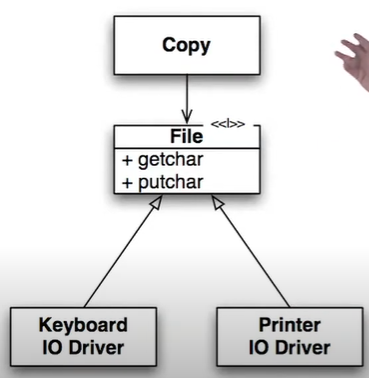
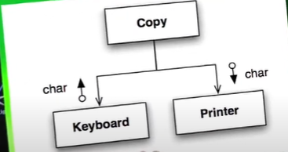

# Boundaries

## Learning test are better than free

Not only are learning tests free, they have a positive return on investment. When there
are new releases of the third-party package, we run the learning tests to see whether there
are behavioral differences.

Below code is a good example of a learning test, doesen't assert anything. For logging I used the logback
framework, but tomorrow suppose some critical vulnerability comes up and I need to migrate to Log4J. This
test will help me in testing the API, before shipping to prod.

```java
 // a simple learning test for logging
@Test
    public void isLogGenerating(){
        LogUtil.logInfo("Tests executed");
    }
}

```

## Adapter Pattern

The Adapter Pattern is like a translator between incompatible interfaces, allowing two otherwise incompatible classes to work together 
seamlessly — all without modifying their existing code.

How it works

- Client code calls methods on the target interface.
- The adapter implements the target interface.
- Inside the adapter, it converts (adapts) the calls to the methods of the adaptee, which actually does the work.
- The adapter returns results (if any) back to the client in the expected format.

## Inversion of Control


```C

//the client has no option to change, it will have to read from keyboard and write to printer
//Adding new devices will cause copy to fan out

void copy(){
	int c;
	while((c = readKeyboard) != EOF){
		writePrinter(c);
	}
}

// Inversion of control : Read from STDIN and write to STDOUT
// STDIN can be anything a keyboard, internet device etc
// STDOUT could be anything a printer, screen etc

void copy(){
	int c;
	while((c = getchar()) != EOF){
		putchar(c);
	}
}
```

```java
//OO version

public interface Reader{
	char getchar();
}

public interface Writer{
	char putchar();
}

void copy(Reader reader, Writer writer){
	int c;
	while((c = reader.getchar()) != EOF){
		writer.putchar(c);
	}
}

public Keyboard implements Reader{...}
public Printer implements Writer{...}

```



